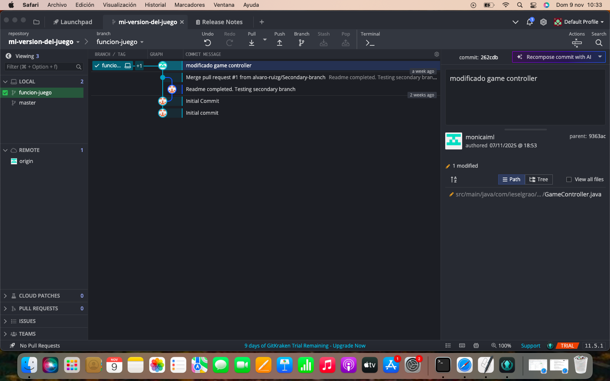
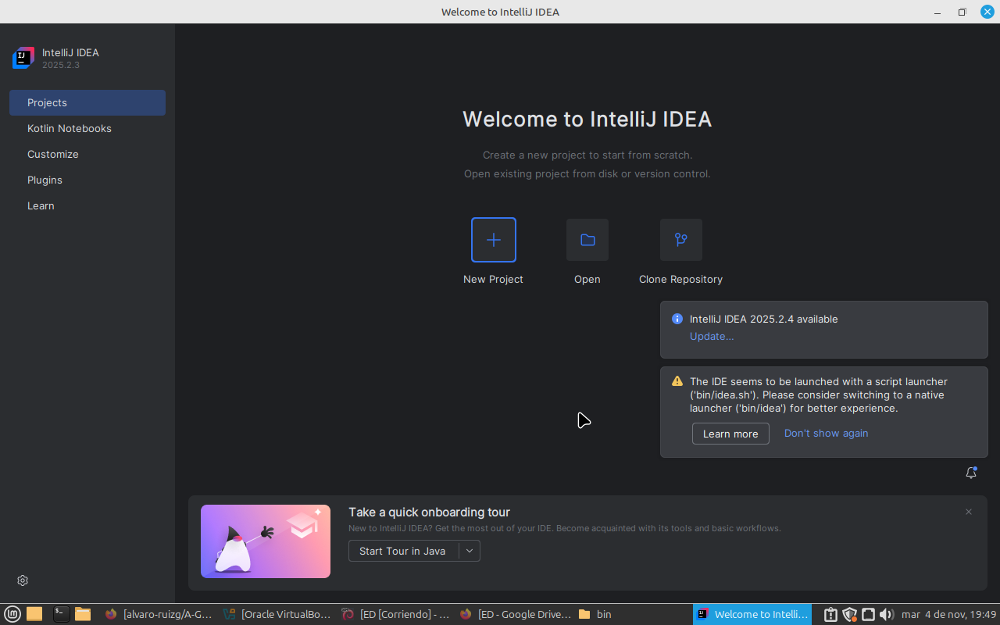
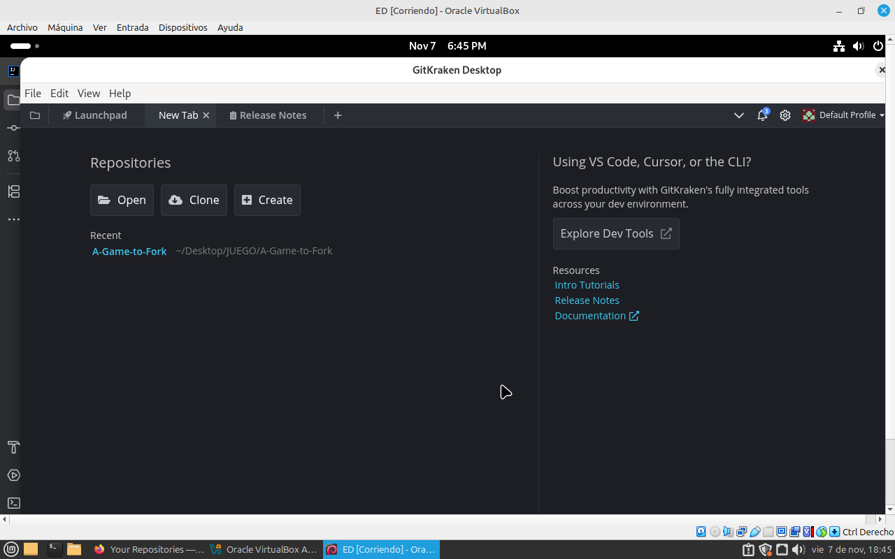

🎮 Proyecto A-Game-to-Fork modificado por Isabel Monica Martinez Lopez

🎮 Descripción del Proyecto

El objetivo principal es hacer un fork (bifuración) del proyecto A-Game-to-Fork, para mejorar
la lógica del juego o añadir funcionalidades y crear un repositorio propio donde se vea esto. 
Se realiza con una nueva rama de desarrollo y después se fusionan los cambios con la principal. 
Creación archivo README.md.
  
🚀 Funcionalidades añadidas 

En esta versión del juego he modificado:

- El número máximo de vidas en cada partida. 

🧩 Tecnologías utilizadas

-Control de versiones: Git + GitHub + GitKraken

-IntelliJ Idea

🔧 Proceso de desarrollo

1.Creación del repositorio

- Creé un repositorio vacío en mi cuenta de GitHub llamado
¨mi-version-del-juego¨.

2.Descarga de GitKraken

-Descarga de la pagina oficial https://www.gitkraken.com/

-Vinculé la cuenta de GitHub y GitKraken

3.Clonado del repositorio original

-Cloné el proyecto en local directamente desde GitKraken.

-Luego reemplacé el remoto por mi propio repositorio desde origin en GitKraken.

 

4.Creación de una nueva rama

-Usando GitKraken, creé la rama funcion-juego para trabajar de forma
aislada.

5.Desarrollo y confirmación de cambios

-Descarga del IDE IntelliJ Idea

-Abrí el proyecto en el IDE y modifiqué el código java, concretamente el game model,
el número máximo de vidas en cada partida.

-Guardé los cambios.

-Abrí el proyecto modificado en GitKraken y realicé un commit con el mensaje:¨Commit para Pull Request¨
-Luego hice push a la rama nueva-funcion. 

6.Fusión con la rama principal desde GitKraken

-Creación pull request para cambiar de la rama función-juego a la rama master remota

-Checkout main en la rama master para cambiar a la rama principal en local

-Merge de la rama funcion-juego con rama master 

-Realicé un último push

📄 Documentación

• Eliminé el antiguo README.md y creé este nuevo archivo.

• Se incluyen capturas del proceso.

📷 Capturas de pantalla

🎮Ejecución juego

-Este proyecto está configurado con Maven. 

-Utiliza IDE IntelliJ Idea para ejecutarlo correctamente.

🎮 Uso de la IA

-ChatGPT (OpenAI) para apoyo en explicación de conceptos.

 
 
